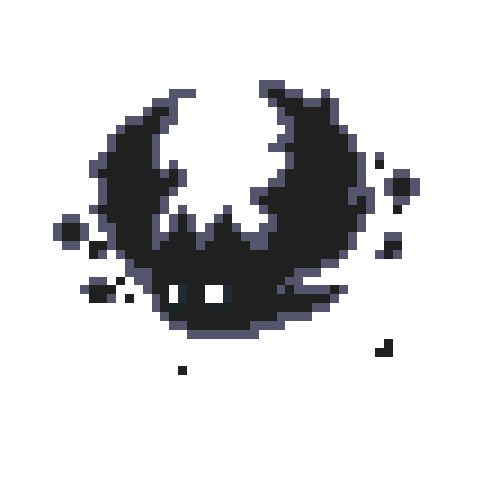
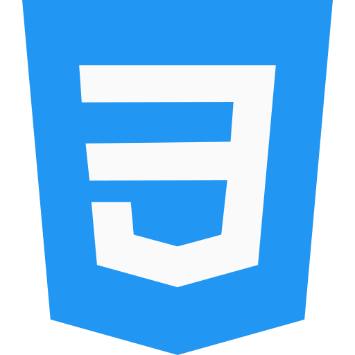
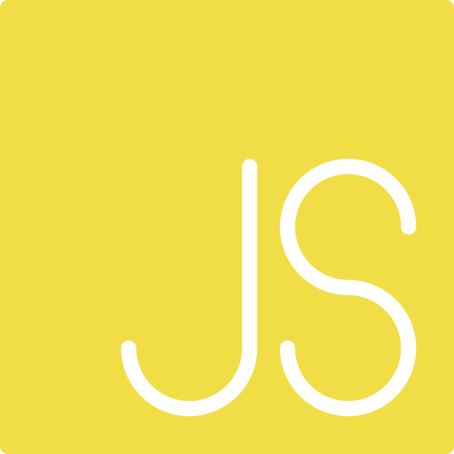

<!-- APRESENTAÇÃO GIF -->

<!-- APRESENTAÇÃO -->
<h1 align="right">Hi, nice to meet you
    
</h1>

Welcome to my page!
     
    I'm Matheus Vidigal, front-end developer, currently 18 years old and passionate about programming.
     
    
    
    

   <!--spacing-3x-->

<!-- FOCO... -->
<h3 align="left">
    &nbsp;&nbsp;&nbsp;&nbsp;&nbsp;&nbsp;
    A Beginner Developer Focused On Web / Mobile
</h3>

<!-- SOBRE MIM -->
- 🌱 I am currently studying JS and CSS at [Rocketseat](https://app.rocketseat.com.br/me/matheus-vidigal-nyctibius) and [Digital Innovation One](https://web.digitalinnovation.one/users/matheus_dev_07?tab=achievements)

- 👨🏻‍💻 I’m looking to collaborate on web projects

- 🤔 I’m looking for help with SQL and remote servers

- ✉ How to reach me **matheus.dev.07@gmail.com**

- ⚡ Fun fact i'm a big fan of One Piece

 <!--spacing-->

<!-- TECNOLOGIAS -->
<h3 align="right">
    My Development Stack
    &nbsp;
</h3>

 &nbsp;
    <code></code>&nbsp;
    <code></code>&nbsp;
    <code></code>&nbsp;
    |&nbsp;
    <code></code>&nbsp;
    <code></code>&nbsp;
    <code></code>&nbsp;
    |&nbsp;
    <code></code>&nbsp;
    <code></code>&nbsp;
    |&nbsp;
    <code></code>&nbsp;
    <code></code>&nbsp;
    <code></code>&nbsp;
    |&nbsp;
    <code></code>&nbsp;
    <code></code>&nbsp;
    <code></code>&nbsp;
    <code></code>&nbsp;
    <!-- https://devicon.dev/ -->

 <!--spacing-->

<!-- API | MYGITHUB -->

    
    

<!-- #282a36 | fbfbfb
     #ff79c6 | 6651ab
     #ff441e | ff3108 -->

<!-- API | POINTS -->

    

---

<!-- REDES SOCIAIS -->

    
    
    
    
    

<!--
**NyctibiusVII/NyctibiusVII** is a ✨ _special_ ✨ repository because its `README.md` (this file) appears on your GitHub profile.

Here are some ideas to get you started:

- 🔭 I’m currently working on ...
- 🌱 I’m currently learning ...
- 👯 I’m looking to collaborate on ...
- 🤔 I’m looking for help with ...
- 💬 Ask me about ...
- 📫 How to reach me: ...
- 😄 Pronouns: ...
- ⚡ Fun fact: ...
-->